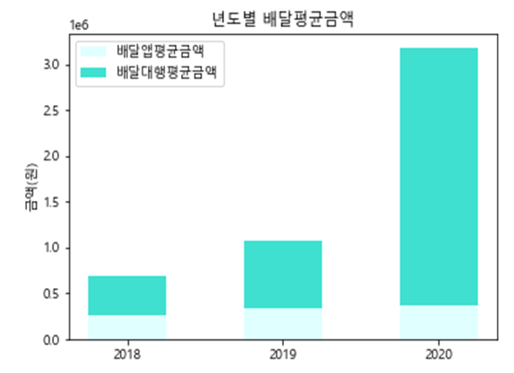
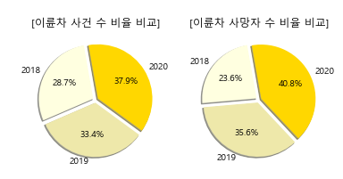
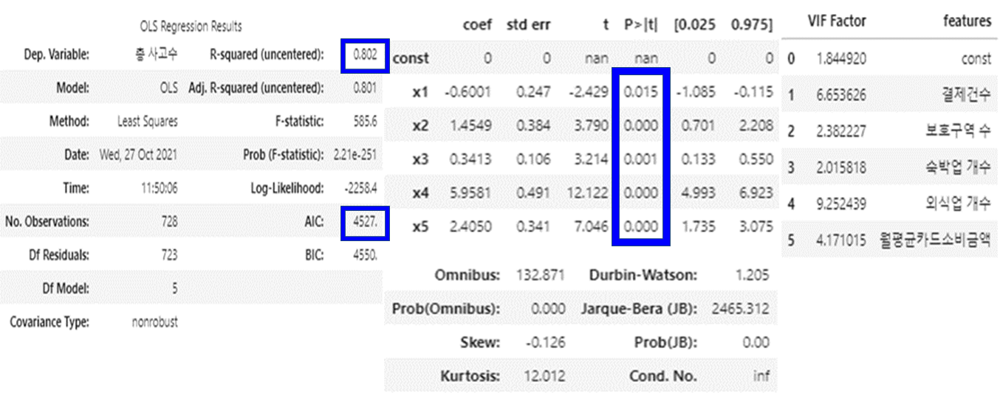
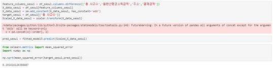
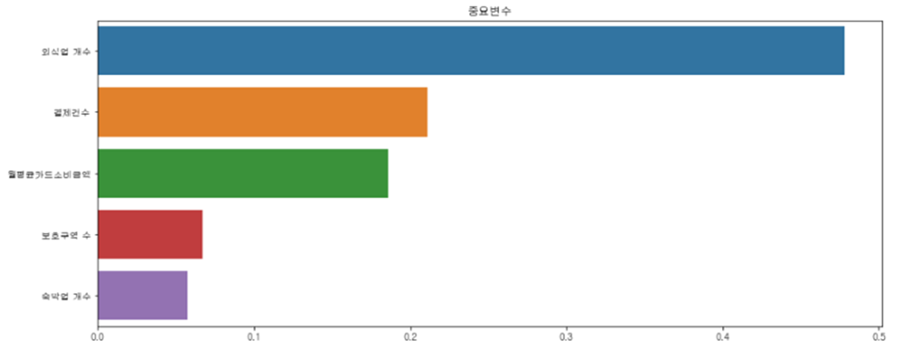
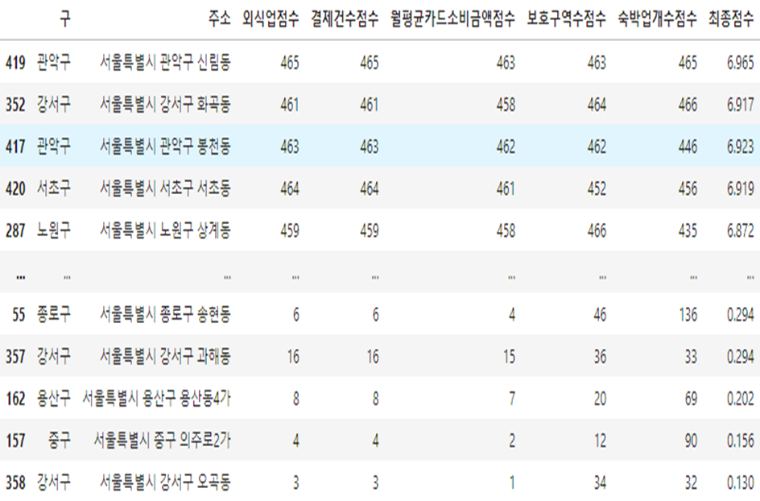
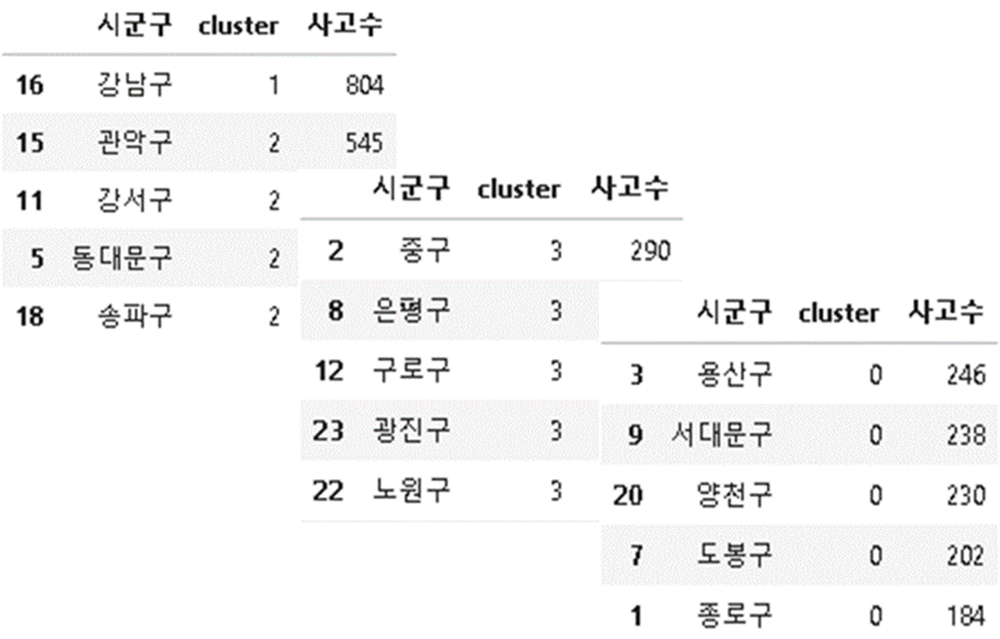

> 데이터 분석을 통한 사회문제 해결 팀 프로젝트
>
> - 기획배경 : 데이터 활용 아이이터&시각화 경진대회
> - 주관 : 과학기술통신부, 한국데이터산업진흥원
> - 장소 : 데이터안심구역
> - 팀원 수 : 3
> - 결과 : 우수상 수상

## 주제

서울특별시 내의 배달로 인한 이륜차사고를 줄이기 위한 단속구역 지정 프로젝트

## 배경

1. 코로나의 장기화로 배달량이 급증하였다.

2. 배달량의 급증으로 오토바이의 교통량이 증가하였다.

3. 이륜차 사고의 심각성
   - 이륜차 사건 수와 사망자 수의 비율이 해마다 증가하고 있다.

- 그 결과, 교통체증과 오토바이 사고도 늘어나 시민들의 불편과 사고 위험이 이전보다 증가하고 있고, 이에 따라 서울경찰청에서 '이륜차 특별 고통 단속'을 추진하고 있다.

- **위 같은 배경에 따라 서울특별시 내의 단속구역을 적절히 선정하여 효율적인 단속에 기여하고자 한다.**

## 활용 데이터

| 변수종류 | 데이터 명                             | 출처                         | 전처리                                               |
| -------- | ------------------------------------- | ---------------------------- | ---------------------------------------------------- |
| 종속변수 | 서울/경기 이륜차 사고 데이터          | TAAS 교통사고 분석 시스템    | 법정동별 사고수, 법정동&시간대별 사고수              |
| 독립변수 | 전국 어린이 보호구역 표준 데이터      | 공공데이터포털               | 법정동별 어린이 보호구역 수                          |
| 독립변수 | 전국 노인&장애인 보호구역 표준 데이터 | 공공데이터포털               | 법정동별 노인&장애인 보호구역 수                     |
| 독립변수 | 지역별 가맹점 정보                    | 데이터안심구역(신한카드)     | 법정동별 외식업가맹점 수, 법정동별 숙박업가맹점 수   |
| 독립변수 | 지역별 매출 및 이용고객 정보          | 데이터안심구역(신한카드)     | 법정동별 결제 건수, 법정동별 결제 금액               |
| 독립변수 | 자택 직장 정보                        | 데이터안심구역(코리아크레딧) | 법정동별 월환산평균소득, 법정동별 월평균카드소비금액 |

- **가설 : 각 데이터들이 이륜차 사고 수에 영향을 미칠 것이다.**

## 분석 과정

### 01. 지역별 이륜차 사고 수 확인

- 각 지역별로 사고 수에 차이가 있음을 확인하여, 사고 수에 따른 지역별 특징이 있을 것이라는 가설 수립

### 02. 경기+서울 데이터 분석

- 더 많은 데이터를 분석하기 위해 경기 데이터를 추가하였다.

#### 02-1 상관분석

- 지역별 사고 수와 다른 변수들은 외식업개수(0.88) > 결제건수(0.78) > 월평균카드소비금액(0.75) > 월환산소비금액(0.74) > 보호구역 수(0.69) 등 양의 상관관계를 가지는 것을 확인하엿다.

#### 02-2 회귀분석

- 모든 변수의 다중회귀분석
  - F통계량에 대한 p-value가 0.05보다 작아서 유의한 모델이다.
  - R-squared = 0.832로 모델의 설명력이 있다.
  - p-value가 0.144인 '결제금액'변수는 유의하지 않을 가능성이 있다.
  - '월환산평균소득금액'과 '월환산평균소득금액' 변수는 다중공선성 수치가 10을 초과한다.

**⇒ 다중공선성이 매우 높은 ‘월환산평균소득금액’ 변수를 제외하기로 결정**

- ‘월환산평균소득금액’ 변수를 제외한 회귀분석
  - F통계량에 대한 p-value가 0.05보다 작아서 유의한 모델이다.
  - R-squared = 0.802로 모델의 설명력이 있다.
  - p-value가 0.05보다 큰 '결제금액'변수는 유의하지 않다고 판단된다.
  - 다중공선성 수치가 10을 초과하는 변수는 없다.

**⇒ 유의하지 않은 ‘결제금액’ 변수를 제외하기로 결정**

- ‘월환산평균소득금액, 결제금액' 변수를 제외한 회귀분석

  - F통계량에 대한 p-value가 0.05보다 작아서 유의한 모델이다.
  - R-squared = 0.802로 모델의 설명력이 있다.
  - p-value가 0.05보다 큰 변수가 없다.
  - 다중공선성 수치가 10을 초과하는 변수는 없다.

  

  

**⇒ 최종 변수 목록 = [결제건수, 보호구역 수, 숙박업 개수, 외식업 개수, 월평균카드소비금액]**

### 03. 서울데이터를 target 데이터로 선정하여 모델의 유의성 판단

- 선정한 변수들을 통해 만든 모델을 통해 target 데이터를 예측하였을 때 RMSE의 값이 약 8.191로 모델이 유의하다고 판단하였다.

### 04. 변수의 가중치 및 지역별 점수 정의

#### 04-1 변수 가중치

- 회귀분석에서 도출한 회귀계수 + 랜덤포레스트 알고리즘을 활용하여 주요변수에 가중치를 부여하였다.
  - 외식업 : 0.5, 결제건수 0.3, 월평균카드소비금액 0.2, 보호구역 수 0.1, 숙박업 개수 0.05

#### 04-2 지역별 점수

- 지역별로 각 변수의 정렬을 통해 점수로 환산하였다.
  - 예) 변수 : 외식업(데이터 개수 466) -> 1등=466점, 466등=1점
- 가중치를 통해 최종 점수를 도출하엿다.
  - 예) 관악구 신림동의 최종 점수 : 465\*0.005 + 465\*0.004 + 463\*0.003 + 463\*0.002 + 465\*0.001 = 6.965

### 05. 구 별 단속지역 개수 선정

- 사고수 데이터를 통해 군집화를 하여 각 구의 단속구역의 개수를 선정하였다.
  - 군집1 = 3개지역 추천, 군집2 = 2개지역 추천, 군집3 = 1개지역, 군집0 = 0개지역

⇒ 단속을 하기 위한 경찰청의 인력 및 비용을 줄이기 위함

## 결과

- 서울시의 각 25개구에서 점수를 통해 선정된 동별 사고 시간 데이터를 수집하여 집중 단속 시간대까지 추천한다.

**예) 강남구 논현동**

- 13시에 집중 단속 추천

 ## 기대효과

- 서울경찰청의 이륜차 사고를 줄이기 위한 움직임에 맞춰 이번 프로젝트가 앞으로 사회적으로 쓰임이 있을 것으로 기대된다.

#### 경제적 측면

- 투입되는 경찰인력 대비 단속 효율 극대화

#### 사회적 측면

- 배달업 종사자와 시민들의 안전 확보
- 이륜차 사고로 인한 교통체증을 해소하며, 쾌적한 교통 환경 조성

